# Домашнее задание к занятию 17.6 "`Итоговый проект модуля «Облачная инфраструктура. Terraform»`" - `Маховский Виктор`

Инструкция по выполнению итогового проекта:
Используя инструменты Docker, Docker Compose и Terraform, вам необходимо сделать следующее:
 

### Задание 1. Развертывание инфраструктуры в Yandex Cloud.

Создайте Virtual Private Cloud (VPC).
Создайте подсети.
Создайте виртуальные машины (VM):
Настройте группы безопасности (порты 22, 80, 443).
Привяжите группу безопасности к VM.
Опишите создание БД MySQL в Yandex Cloud.
Опишите создание Container Registry.

### Решение

Проект
[network.tf](terraform/network.tf) - VPC, подсети, SG
[vm.tf](terraform/vm.tf) - виртуальная машина + cloud-init
[database.tf](terraform/database.tf) - MySQL
[registry.tf](terraform/registry.tf) - Container Registry

VPC, подсети, группы безопасности (порты 22, 80, 443)
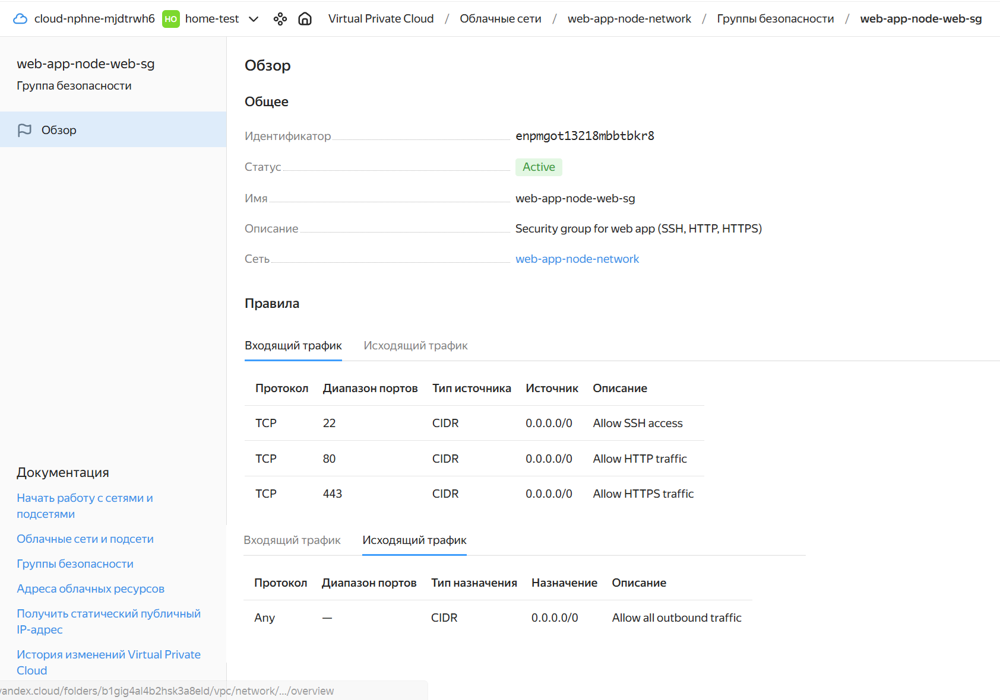

Виртуальная машина. В идеале 3 виртуальные машины, но вроде в задании я не нашел явного ограничения.
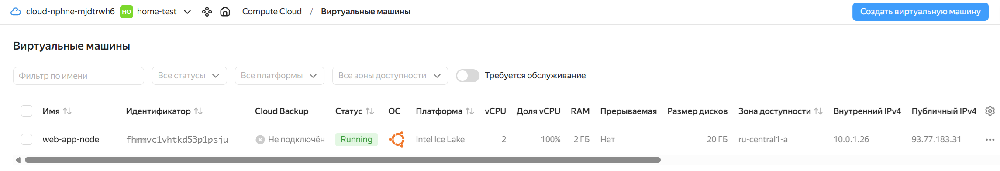

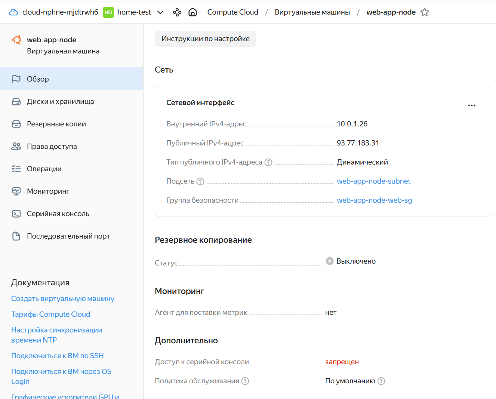

MySQL
Создана БД `app_db` и пользователь `app_user` с правами `roles = ["ALL"]`. Кластер размещён в подсети `10.0.1.0/24` для внутреннего доступа.
**Код database.tf:**` 
```
resource "yandex_mdb_mysql_cluster" "app_db" {
  name        = "${var.vm_name}-mysql"
  environment = "PRESTABLE"
  network_id  = yandex_vpc_network.app_network.id
  version     = "8.0"

  resources {
    resource_preset_id = "s2.micro"
    disk_size          = 10
    disk_type_id       = "network-ssd"
  }

  user {
    name     = "app_user"
    password = var.db_password
    permission {
      database_name = "app_db"
      roles         = ["ALL"]
    }
  }

  database {
    name = "app_db"
  }

  host {
    name      = "mysql-host"
    zone      = var.zone
    subnet_id = yandex_vpc_subnet.app_subnet.id
  }
}
```
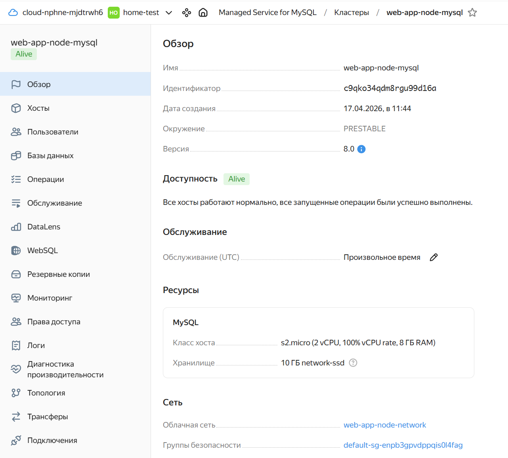

Container Registry
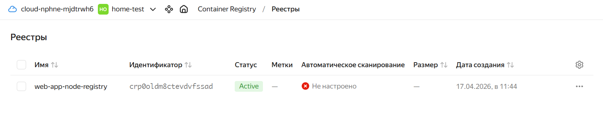
**Код database.tf:**
```
resource "yandex_container_registry" "app_registry" {
  name      = "${var.vm_name}-registry"
  folder_id = var.yc_folder_id
}
``` 

---

 
### Задание 2. Используя user-data (cloud-init), установите Docker и Docker Compose (см. Задания 5 модуля «Виртуализация и контейнеризация»).

### Решение

1. Устанавливает Docker Engine последней версии из официального репозитория
2. Устанавливает Docker Compose (плагин для Docker)
3. Добавляет пользователя `ubuntu` в группу `docker`
4. Создаёт директорию `/opt/app` для приложения

**Код cloud-init **

```
package_update: true
package_upgrade: true

packages:
  - apt-transport-https
  - ca-certificates
  - curl
  - gnupg
  - lsb-release

runcmd:
  # Добавляем GPG ключ Docker
  - curl -fsSL https://download.docker.com/linux/ubuntu/gpg | gpg --dearmor -o /usr/share/keyrings/docker-archive-keyring.gpg
  
  # Добавляем репозиторий Docker
  - echo "deb [arch=amd64 signed-by=/usr/share/keyrings/docker-archive-keyring.gpg] https://download.docker.com/linux/ubuntu $(lsb_release -cs) stable" | tee /etc/apt/sources.list.d/docker.list > /dev/null
  
  # Устанавливаем Docker
  - apt-get update
  - apt-get install -y docker-ce docker-ce-cli containerd.io docker-buildx-plugin docker-compose-plugin
  
  # Добавляем пользователя в группу docker
  - usermod -aG docker ubuntu
  
  # Включаем и запускаем Docker
  - systemctl enable docker
  - systemctl start docker
  
  # Устанавливаем Docker Compose
  - curl -L "https://github.com/docker/compose/releases/latest/download/docker-compose-$(uname -s)-$(uname -m)" -o /usr/local/bin/docker-compose
  - chmod +x /usr/local/bin/docker-compose
  
  # Создаём директорию для приложения
  - mkdir -p /opt/app
```

Вывод VM:
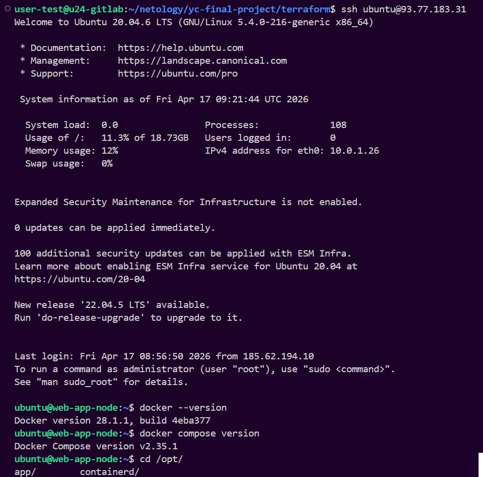

---


### Задание 3. Опишите Docker файл (см. Задания 5 «Виртуализация и контейнеризация») c web-приложением и сохраните контейнер в Container Registry.

### Решение

** Dockerfile **
```
# STAGE 1: Builder - установка зависимостей
FROM python:3.11-slim as builder
WORKDIR /app
COPY requirements.txt .
RUN pip install --user --no-cache-dir -r requirements.txt

# STAGE 2: Runtime - минимальный образ
FROM python:3.11-slim as runtime

LABEL maintainer="viktor@example.com"
LABEL version="1.0"

# Создаём не-рутового пользователя
RUN useradd -m -u 1000 appuser

WORKDIR /app

# Копируем зависимости из builder
COPY --from=builder /root/.local /home/appuser/.local

# Копируем код приложения
COPY src/ ./src

# Настраиваем PATH
ENV PATH=/home/appuser/.local/bin:$PATH

# Передаём права
RUN chown -R appuser:appuser /app

# Запускаем от не-рутового пользователя
USER appuser

# Переменные окружения
ENV FLASK_APP=src/app.py
ENV PYTHONUNBUFFERED=1

EXPOSE 80

# Health check
HEALTHCHECK --interval=30s --timeout=10s --start-period=5s --retries=3 \
    CMD python -c "import urllib.request; urllib.request.urlopen('http://localhost:80/')" || exit 1

# Запуск через gunicorn
CMD ["gunicorn", "--bind", "0.0.0.0:80", "--workers", "2", "src.app:app"]
```

Console yandex cloud image:
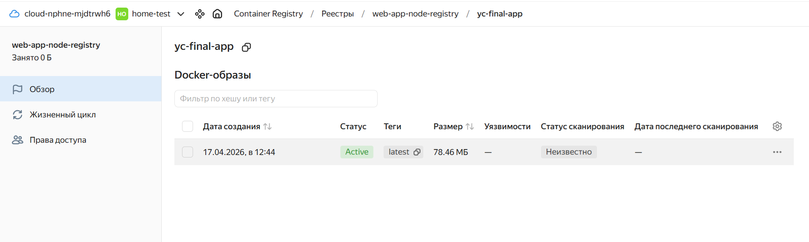

Собираем образ:
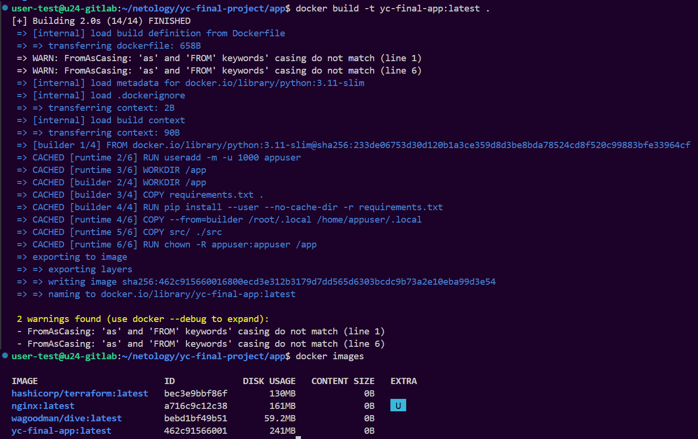

Пушим образ:
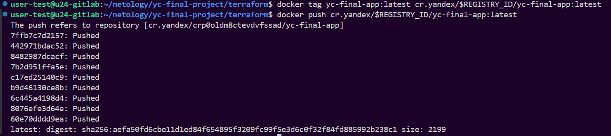

---


### Задание 4. Завяжите работу приложения в контейнере на БД в Yandex Cloud.

### Решение

1. Docker установлен автоматически при старте ВМ
2. Файлы `.env` и `docker-compose.yml` созданы автоматически с переменными из Terraform
3. Приложение настроено на подключение к Managed MySQL

	
Docker:
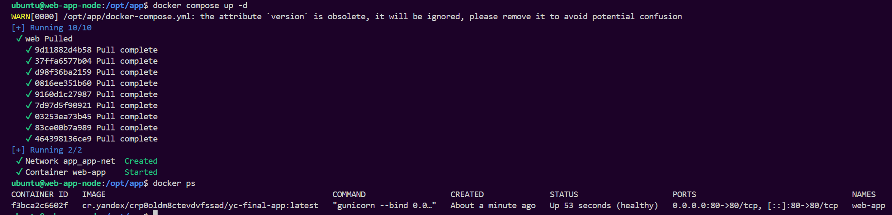

Доступность:
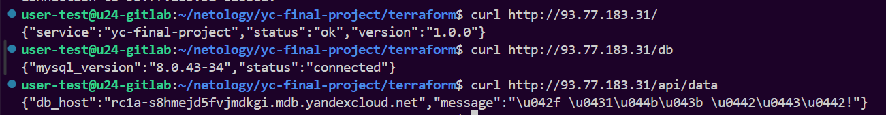

---


### Доработка ДЗ
1. Блокировка state реализовал через S3 backend + DynamoDB.
2. Правила для security groups генерируются через dynamic блоки.
```
# network.tf
dynamic "ingress" {
  for_each = var.web_ingress_rules
  content {
    protocol       = ingress.value.protocol
    port           = ingress.value.port
    v4_cidr_blocks = ingress.value.cidr_blocks
    description    = ingress.value.description
  }
}

# variables.tf:
variable "web_ingress_rules" {
  default = [
    { port = 22, protocol = "TCP", description = "SSH", cidr_blocks = ["0.0.0.0/0"] },
    { port = 80, protocol = "TCP", description = "HTTP", cidr_blocks = ["0.0.0.0/0"] },
    { port = 443, protocol = "TCP", description = "HTTPS", cidr_blocks = ["0.0.0.0/0"] }
  ]
}
```

3. Создан модуль modules/vpc
```
modules/vpc/
├── main.tg
├── variables.tf
└── outputs.tf
```

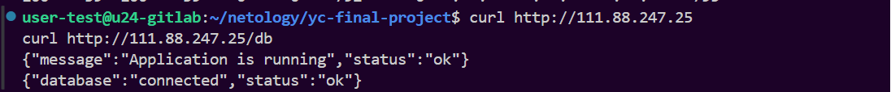

### Доработка ДЗ - 2
Блокировка state через S3 bucket.
Ключи доступа через переменные окружения AWS_ACCESS_KEY_ID и AWS_SECRET_ACCESS_KEY.

** providers.tf **
```
terraform {
  required_version = ">= 1.5"

  backend "s3" {
    endpoints = {
      s3 = "https://storage.yandexcloud.net"
    }
    bucket = "mbrhard-tf-state-05-1776752950"
    region = "us-east-1"
    key    = "final-project/terraform.tfstate"

  }

  required_providers {
    yandex = {
      source  = "yandex-cloud/yandex"
      version = "~> 0.108"
    }
  }
}

provider "yandex" {
  token     = var.token
  cloud_id  = var.cloud_id
  folder_id = var.folder_id
  zone      = var.zone
}
```